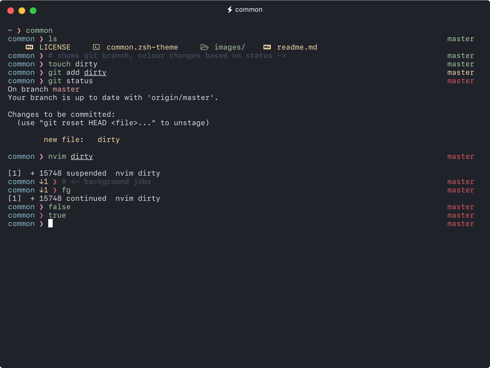

<p align="center">
  
<p align="center">A simple, clean and minimal prompt.</p>

<p align="center"></p>

- Current working directory
- Hostname (Shown on remote SSH shell only)
- AWS Vault Role
- Background jobs
- Current SHA (optional)
- Exit code of last command
- Git branch/status
- Customisable colour scheme

## Installation

### [Oh My Zsh](http://ohmyz.sh)

```sh
wget -O $ZSH_CUSTOM/themes/common.zsh-theme https://raw.githubusercontent.com/jackharrisonsherlock/common/master/common.zsh-theme
```

Update your `.zshrc` file with:
```sh
ZSH_THEME="common"
```

### [Antigen](https://github.com/zsh-users/antigen)

Update your `.zshrc` file with:

```sh
antigen theme jackharrisonsherlock/common
```

### [Antibody](https://github.com/getantibody/antibody)

Update your `.zshrc` file with:

```sh
antibody bundle jackharrisonsherlock/common
```

## Terminal

In the screenshot you see Common running in [Hyper](https://hyper.is/) with a [custom colour theme](https://github.com/jackharrisonsherlock/dotfiles/blob/master/dots/.hyper.js) based on [Ray.so Breeze](https://ray.so/) and [SF Mono](https://developer.apple.com/fonts/) font.
